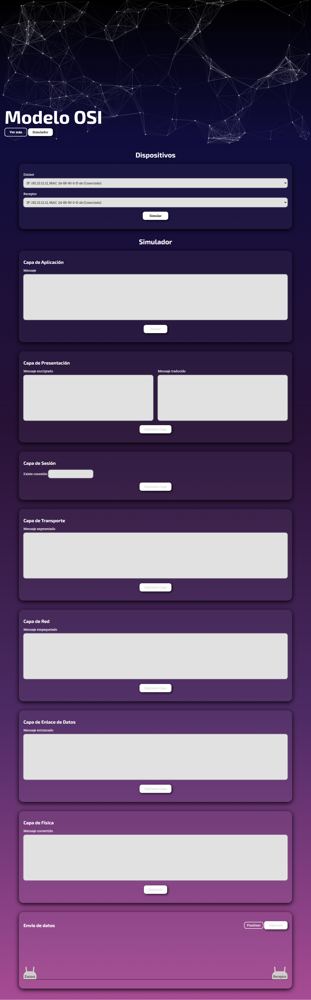

# Modelo OSI - HTML, CSS, JS y PHP
Simulación del envió de información con el modelo OSI con HTML, CSS, JS y PHP. Proyecto del **séptimo semestre** de estudios de Ingeniería Informática en el curso Teleprocesos, presentado el **26/06/2021**.

<strong>Imagen:</strong> Página Web de Simulación del Modelo OSI.

