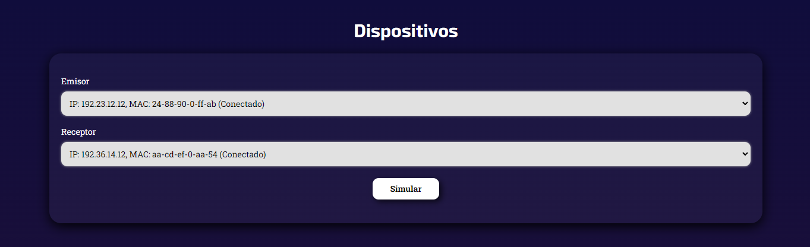
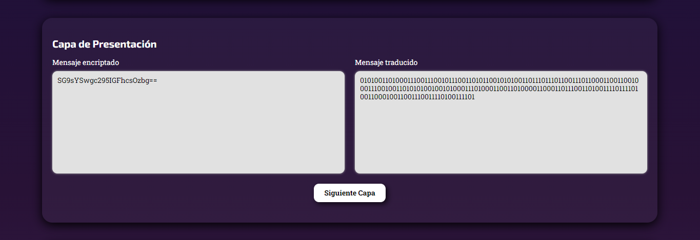
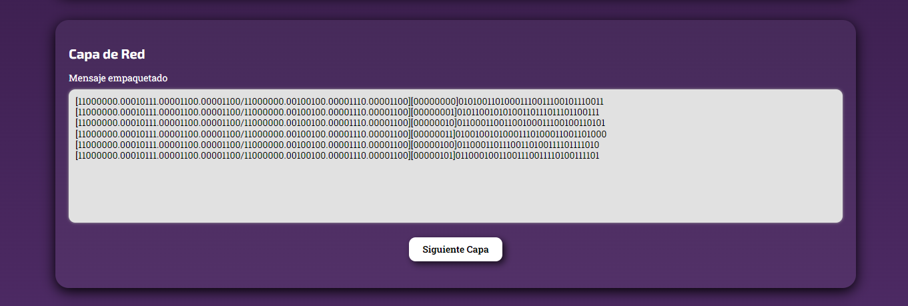
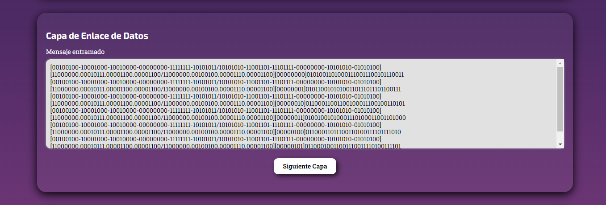
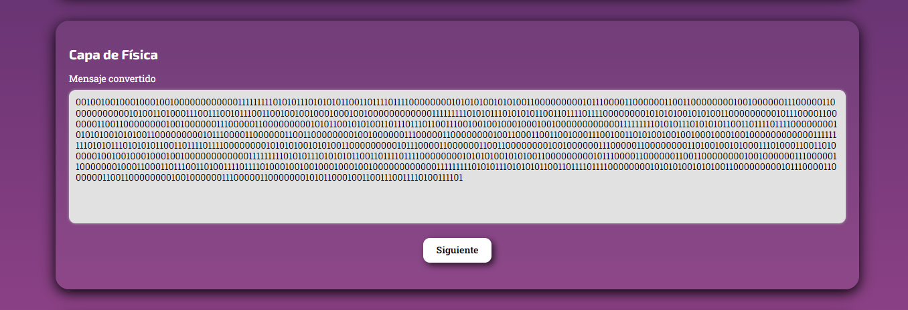
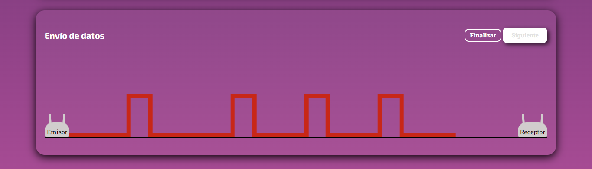

# Modelo OSI - HTML, CSS, JS y PHP
Simulación del envió de información con el modelo OSI con HTML, CSS, JS y PHP. Proyecto del **séptimo semestre** de estudios de Ingeniería Informática en el curso Teleprocesos, presentado el **26/06/2021**.

<strong>Imagen:</strong> Página Web de Simulación del Modelo OSI.

## Uso
1. [**Dispositivos**](#dispositivos)
2. [**Simulador**](#simulador)
   - [**Capa de aplicación**](#capa-de-aplicación)
   - [**Capa de presentación**](#capa-de-presentación)
   - [**Capa de sesión**](#capa-de-sesión)
   - [**Capa de transporte**](#capa-de-transporte)
   - [**Capa de red**](#capa-de-red)
   - [**Capa de enlace de datos**](#capa-de-enlace-de-datos)
   - [**Capa física**](#capa-física)
 3. [**Envío de datos**](#envío-de-datos)

## Dispositivos

<strong>Imagen:</strong> Elección de dispositivos.

## Simulador

### Capa de aplicación

<strong>Imagen:</strong> Aplicación.

### Capa de presentación

<strong>Imagen:</strong> Presentación.

### Capa de sesión

<strong>Imagen:</strong> Sesión.

### Capa de transporte

<strong>Imagen:</strong> Transporte.

### Capa de red

<strong>Imagen:</strong> Red.

### Capa de enlace de datos

<strong>Imagen:</strong> Enlace de Datos.

### Capa física

<strong>Imagen:</strong> Física.

## Envío de datos

<strong>Imagen:</strong> Simulación de envío de datos.

